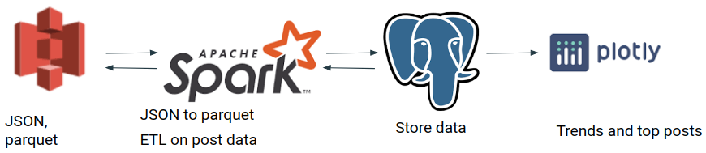

# Reddit Ads
Data pipeline for historical Reddit data

**Programming Languages**: Python, SQL, shell scripting

**Technologies**: Spark, Posgresql, Dash/Plotly

**AWS Services**: S3, EC2, Secrets Manager

[Slides](https://docs.google.com/presentation/d/1RnfaQbXpeO8Gn6usoUpiTrwgdkaIlmAPKILA0G3qvEs/edit?usp=sharing)    
[Front-end](http://insight.redditadsproject.xyz)
## Introduction
Reddit, the self-proclaimed "front page of the internet", is the sixth most popular website in the US[1], and has on average 21 billion screen views per month [2]. This is prime real estate for advertising. Adverstisers want to maximize the reach of their advertisements, either by advertising early on posts that are engaging, or commenting on these posts early to maximize user interaction.

While the term "engaging post" is ambiguous and may be the subject of it own data science study, I defined "engaging post" as a post that has a greater than average number of comments or score. Since the time window is not specified in the definition, advertisers may define the appropriate threshold for an "engaging post" based on the appropriate time scale that best matches that of the advertising campaign.

## Quickstart Guide
### Postgresql
1. Install Postgresql and setup the database for remote access.
2. Create database 'reddit' and then create the tables using the scripts in `databasse/scripts`.
### Spark Cluster Setup
0. Setup keyless ssh between the master and worker nodes.
1. Install prerequisites and Spark binaries using the script `install_spark_prereqs.sh` in the `setup` directory. Install the python3 packages listed in `requirements_spark_cluster.txt` in the `setup` directory on the master and worker nodes.
2. Setup the master node according to this [article](https://blog.insightdatascience.com/simply-install-spark-cluster-mode-341843a52b88).
### Prepare Data
1. Download pushshift data and upload JSON data to an AWS S3 bucket using `download_and_upload_daily_post_data.sh` script in the `data_ingestion` directory.
2. Run `run_convert_to_parquet.sh` script in the `data_processing/convert_to_parquet` directory (you will probably need to add arguments, such as the appropriate AWS S3 bucket url, to the script).
### Process Data
This guide assumes that you are using AWS Secrets Manager to store database login credentials.
1. In the `utils` directory, rename `sample_get_postgres_credentials.py` to `get_postgres_credentials.py`, adding the required string to access the database login credentials from AWS Secrets Manager.
2. Run the `run_process_daily_posts.sh` script in the `data_processing` directory, adding arguments as necessary.
### Dash Front-End
1. Install dash requirements in `requirements_dash_front_end.txt` in the `setup` directory. You may find the script `dash_setup.sh` in the `setup` directory helpful.
2. Run `python3 dash_reddit_pipeline.py` to start the front end. You may need to configure `sample_get_postgres_credentials.py` as discussed in the **Prepare Data** section. You may also need to change certain arguments in the python file in order to connect to the correct database tables in Postgresql.

## Project Details

### The Data
The data is the daily post data for December 2019 downloaded from [pushshift](https://files.pushshift.io/reddit/daily/). The data is stored in JSON format. The files are stored in an AWS S3 bucket.

### Data Processing
#### Conversion to Parquet
In order to take advantage of parquets optimizations for quick reads, the data was converted from JSON to parquet format. The parquet file was uploaded to an AWS S3 bucket.

#### Computing Statistics
All post data for a given day is stored in individual file. On a high level, Spark reads in the data from S3, computes daily or monthly statistics, such as average score, average number of comments, and percentiles, and then writes the transformed data to a Postgresql database.

## References
[1] https://www.alexa.com/siteinfo/reddit.com#section_traffic "Reddit Alexa Ranking"

[2] https://foundationinc.co/lab/reddit-statistics/ "Reddit Statistics for 2020"
